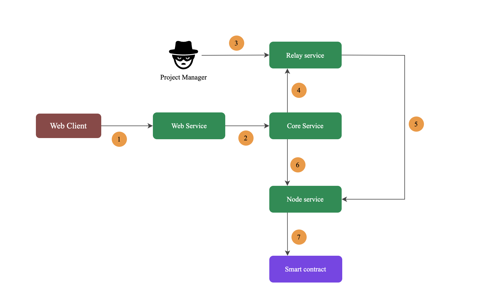

# Components

### Components overview

- Smart contract: No code is required and contracts are automatically generated based on user-defined configurations
- Web Client/ Service: Web pages and corresponding services for user interaction
- Relay Service: The process data of Campaigns event is collected to prove whether the corresponding task has been completed. If it has been completed, a task result proof is finally generated
- Core Service: Verify points rules，Calculate the user's final points
- Node Service: Provide node services that interact with the chain

# Components relations

1. The web client sends user-related requests to the web service.
2. The web service obtains the user's points balance from the core service, The web service sends a request for redemption points to the core service.
3. For some special task types, the project manager needs to provide the corresponding data.
4. The core service gets the results of the tasks performed by the user from the relay service.
5. For some task types, relay service needs to obtain relevant data information from node service.
6. The core service needs to build the transaction through the Node service and send the transaction to the chain.
7. The Node service collects transaction data on the blockchain, And sends transactions to the blockchain.

